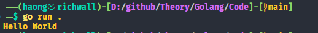

# GO LANG
> All code and theory learned accordingly this [roadmap](https://roadmap.sh/golang)
---

## 1. Basic Syntax
### 1.1. Simple Hello World Program.
1. First of all run ```go mod init Code/hello``` to enable dependency tracking code
1. Create a file `hello.go` and fill with following code belo 
```go
package main

import "fmt"

func main () {
    fmt.Println("Hello World!")
}
```
1. In terminal run `go run .` 



